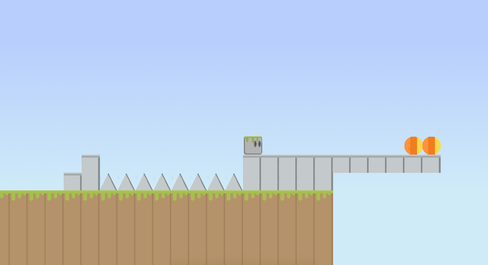

# DD1349 - projinda18

Developed by Eric Vickström and Oscar Almqvist.  
This project will be under development for 3 weeks during the course DD1349 INDA 2018 at KTH.

## Project

2D-platformer. You play as a stone golem and the goal with the game is to reach the portals. When you have reached each

Following game design ideas are implemented:
- Spikes
- Trampoline
- Buffs
- Jump

The game saves all maps in text-files and all the textures in a spritesheet. We use JavaFX to loop the game.

We have made that every single tile has an action. If the player touches the tile, their respective actions-method will be called. Please note that not all tiles have collision, we made it that way to increase performance. Each tile is divided into 4 parts. Top, right, bottom and left. We can decided different actions for all these parts.

We have a lot of issues left. These are in the milestone "extra features". These issues are only ideas and not things that we believe are necessary for the final project.

## Installation

We have made it easy, so if you are interested to run the game right away you can just run the .jar file. If you want to compile it yourself, we recommend using an IDEA for example IntelliJ. Open IntelliJ and use the import project button and then choose projinda18 after cloning the project.

## Preview

